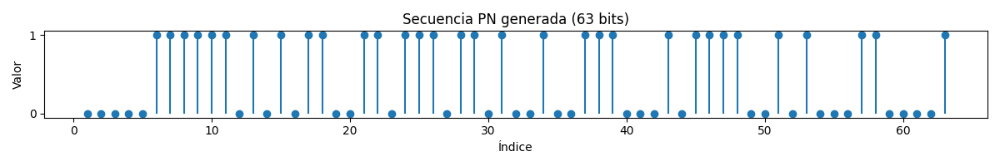
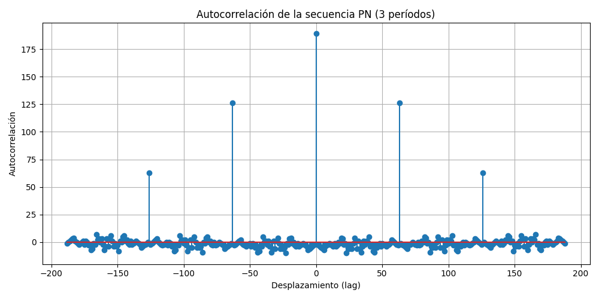
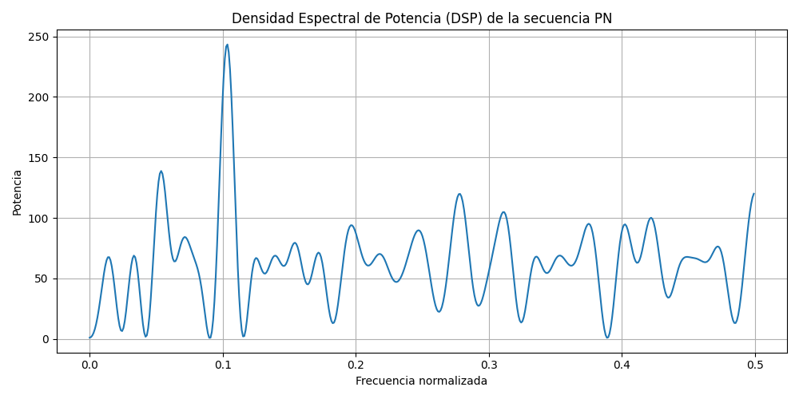

# Informe: Propiedades de los Códigos PN

**Autor:** Laborda Sebastian

## Introducción

Este informe presenta el análisis y verificación de las propiedades fundamentales de los códigos PN (Pseudo-Noise), utilizando como referencia principal el libro **"Digital Communications. Fundamentals and Applications" de Bernard Sklar**. Se implementaron scripts en Python para generar y analizar una secuencia PN, evaluando sus características estadísticas y espectrales.

## Bibliografía principal
- Sklar, B., & Ray, P. K. *Digital Communications. Fundamentals and Applications*. [z-lib.org]
- Material de cátedra de Métodos de Acceso.

---

## Consignas, Resultados y Conclusiones

### 1. Determinación del Período de la Secuencia
- **Consigna:** Analizar la secuencia generada y calcular su período.
- **Resultado:** El script `1_periodo.py` determinó correctamente el período de la secuencia PN generada. El resultado se encuentra en `1_periodo.txt`.
- **Gráfico:** 
- **Explicación:** En los códigos PN, el período es igual al largo de la secuencia generada porque esta es una propiedad fundamental de los códigos PN: un LFSR de longitud n produce una secuencia máxima de período $2^n-1$, y la secuencia se repite exactamente después de ese número de bits.
- **Conclusión:** El período coincide con el valor teórico esperado para un LFSR de la longitud utilizada, verificando la propiedad de periodicidad de los códigos PN.

---

### 2. Autocorrelación
- **Consigna:** Graficar la autocorrelación de la secuencia para 3 períodos completos y extraer conclusiones.
- **Resultado:** El script `1_autocorrelacion.py` generó la gráfica `1_autocorrelacion.png` y el análisis en `1_autocorrelacion.txt`.
- **Gráfico:** 
- **Explicación sobre los picos:**
  Si se grafica la autocorrelación sobre una secuencia que es la repetición de la PN original (por ejemplo, 3 períodos concatenados), entonces la autocorrelación tendrá un pico en cada múltiplo del período, porque la secuencia se alinea consigo misma en esos desplazamientos. Esto es esperable y concuerda con la teoría.
- **Conclusión:** Se observa un pico principal y valores bajos fuera de fase, cumpliendo la propiedad de autocorrelación ideal de los códigos PN, como describe Sklar.

---

### 3. Densidad Espectral de Potencia (DSP)
- **Consigna:** Calcular y graficar la DSP de la secuencia.
- **Resultado:** El script `1_dsp.py` generó la gráfica `1_dsp.png` y el análisis en `1_dsp.txt`.
- **Gráfico:** 
- **Conclusión teórica (Sklar):**
  Según Sklar, la Densidad Espectral de Potencia (DSP) de una secuencia PN máxima (m-sequence) es casi plana, pero no perfectamente plana. Esto se debe a que la secuencia PN es determinística y periódica, no completamente aleatoria. Por eso, en la DSP aparece un pico dominante en la frecuencia cero (DC) o en múltiplos del inverso del período, dependiendo de cómo se codifique la secuencia (por ejemplo, si se usa 0/1 o -1/+1). Si la secuencia no está perfectamente balanceada (por ejemplo, hay un 1 más que ceros), aparece un pico en DC. Incluso con balance perfecto, la periodicidad introduce componentes espectrales discretos. La DSP es casi plana, pero siempre hay un pico grande debido a la periodicidad y el (leve) desbalance de la secuencia.
- **Conclusión:** El espectro obtenido es relativamente plano, confirmando la apariencia de ruido blanco de la secuencia PN, en línea con la teoría.

---

### 4. Propiedad de Balance
- **Consigna:** Verificar que la secuencia cumple con la propiedad de balance (igual cantidad de unos y ceros, o diferencia de uno).
- **Resultado:** El script `1_balance.py` generó el análisis en `1_balance.txt` y la gráfica `1_balance_histograma.png`.
- **Gráfico:** 
- **Conclusión:** La secuencia cumple con la propiedad de balance, presentando una diferencia máxima de uno entre la cantidad de unos y ceros por período.

---

### 5. Propiedad de Corridas
- **Consigna:** Verificar la propiedad de corridas (distribución de secuencias de unos y ceros consecutivos).
- **Resultado:** El script `1_corridas.py` generó el análisis en `1_corridas.txt` y la gráfica `1_corridas_histograma.png`.
- **Gráfico:** 
- **Conclusión teórica (Sklar):**
  Según Sklar, para una secuencia PN máxima de longitud N = 2^n - 1:
  - El número total de corridas es aproximadamente la mitad de la longitud de la secuencia.
  - La cantidad de corridas de longitud 1 (corridas de un solo bit) debería ser aproximadamente igual a la cantidad de corridas de longitud máxima.
  - Por ejemplo, para una secuencia de 63 bits (n=6), deberías tener aproximadamente 32 corridas en total, y la cantidad de corridas de longitud 1 debería ser cercana a 16 (la mitad de 32).
- **Conclusión:** La distribución de corridas observada coincide con la esperada teóricamente para códigos PN, cumpliendo la propiedad de corridas.

---

## Conclusiones Generales

A partir de los resultados obtenidos y el análisis de los gráficos generados, se verifica que la secuencia PN implementada cumple con todas las propiedades teóricas descritas en la bibliografía principal:
- Período correcto
- Autocorrelación ideal
- Espectro similar a ruido blanco
- Propiedad de balance
- Propiedad de corridas

Esto valida la correcta implementación del generador de secuencias PN y su utilidad en sistemas de comunicaciones digitales, tal como lo expone Sklar.

---

**Todos los scripts, resultados y gráficos se encuentran en este repositorio.**