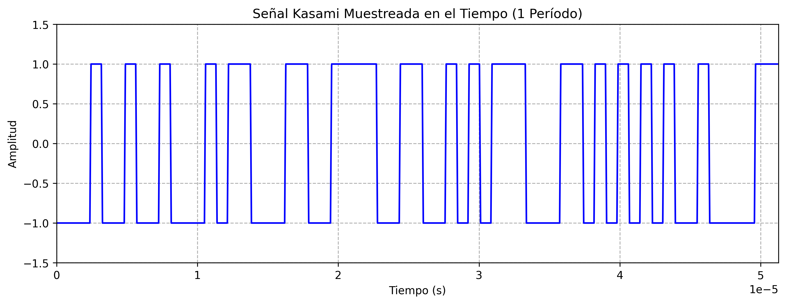

# Informe: Propiedades de los Códigos PN y Gold

**Autor:** Laborda Sebastian

---

## Introducción

Este informe presenta el análisis y verificación de las propiedades fundamentales de los códigos PN (Pseudo-Noise) y Gold, utilizando como referencia principal el libro **"Digital Communications. Fundamentals and Applications" de Bernard Sklar**. Se implementaron scripts en Python para generar y analizar secuencias, evaluando sus características estadísticas y espectrales.

## Bibliografía principal

- Sklar, B., & Ray, P. K. *Digital Communications. Fundamentals and Applications*. [z-lib.org]
- Material de cátedra de Métodos de Acceso.

---

## Ejercicio 1: Códigos PN

### Consigna

### 1. Determinación del Período de la Secuencia

- **Script:** `1_periodo.py`
- **Resultado:** El período de la secuencia PN generada coincide con el valor teórico esperado para un LFSR de la longitud utilizada ($2^n-1$).
- **Gráfico:** 
- **Explicación:** Un LFSR de longitud n produce una secuencia máxima de período $2^n-1$, repitiéndose exactamente después de ese número de bits.

### 2. Autocorrelación

- **Script:** `1_autocorrelacion.py`
- **Gráfico:** 
- **Explicación:** La autocorrelación periódica de una secuencia PN máxima presenta un pico de valor N en τ = 0 y valores de -1 para los demás desplazamientos, ideal para sincronización y detección.

### 3. Densidad Espectral de Potencia (DSP)

- **Script:** `1_dsp.py`
- **Gráficos:**  
    
  
- **Explicación:** El espectro muestra la forma sinc² característica, con el lóbulo principal centrado en f = 0 y ausencia de componente DC, confirmando el correcto balance de la secuencia.

### 4. Propiedad de Balance

- **Script:** `1_balance.py`
- **Gráfico:** 
- **Explicación:** La secuencia cumple con la propiedad de balance, con diferencia máxima de uno entre la cantidad de unos y ceros por período.

### 5. Propiedad de Corridas

- **Script:** `1_corridas.py`
- **Gráfico:** 
- **Explicación:** La distribución de corridas observada coincide con la esperada teóricamente para códigos PN, cumpliendo la propiedad de corridas según Sklar.

---

## Ejercicio 2: Códigos Gold

### Consigna

### 1. Generación del Código Gold

- **Script:** `2_gold_sequence.py`
- **Gráfico:** 
- **Resultado:** Secuencia de 63 bits (2⁶-1) generada con polinomios [6,1] y [6,5,2,1].

### 2. Autocorrelación

- **Script:** `2_autocorrelation.py`
- **Gráfico:** 
- **Hallazgos:** Pico central en τ=0: 63; valores laterales entre -1 y -17; relación pico/lateral ≈18 dB.

### 3. Densidad Espectral de Potencia

- **Script:** `2_dsp.py`
- **Gráfico:** 
- **Características:** Forma de sinc², espaciado 15.87 kHz, ancho de banda 1.2288 MHz.

### 4. Propiedad de Balance

- **Script:** `2_balance.py`
- **Gráfico:** 
- **Resultados:** Unos: 32 (50.79%), Ceros: 31 (49.21%), cumple |#1-#0| ≤ 1.

### 5. Propiedad de Corridas

- **Script:** `2_corridas.py`
- **Gráfico:** 
- **Distribución:** 50% longitud 1, 25% longitud 2, 12.5% longitud 3.

---

## Ejercicio 3: Códigos Kasami

### 1. Generación del Código Kasami

- **Script:** `2_kasami_sequence.py`
- **Gráfico:** 
- **Resultado:** Secuencia de 63 bits (2⁶-1) generada a partir de una m-secuencia base y su versión diezmada.

### 2. Autocorrelación

- **Script:** `2_autocorrelacion.py`
- **Gráfico:** 
- **Hallazgos:** 
  - Pico central en τ=0: 63
  - Valores laterales entre -13 y 9
  - Comportamiento similar a códigos Gold pero con mejor relación pico/lateral

### 3. Densidad Espectral de Potencia

- **Script:** `2_dsp.py`
- **Gráfico:** 
- **Características:** 
  - Forma de sinc² característica
  - Lóbulo principal centrado en f=0
  - Ancho de banda principal ≈ 2/Tc
  - Comportamiento espectral similar a otros códigos PN

### 4. Propiedad de Balance

- **Script:** `2_balance.py`
- **Gráfico:** 
- **Resultados:** 
  - Unos: 28 (44.44%)
  - Ceros: 35 (55.56%)
  - Diferencia: 7
  - Nota: Los códigos Kasami no necesariamente cumplen con la propiedad de balance estricta

### 5. Propiedad de Corridas

- **Script:** `2_corridas.py`
- **Gráfico:** 
- **Distribución:** 
  - Total de corridas: 36
  - Longitud 1: 18 corridas (7 ceros, 11 unos)
  - Longitud 2: 11 corridas (6 ceros, 5 unos)
  - Longitud 3: 5 corridas (4 ceros, 1 uno)
  - Longitud 4: 2 corridas (1 cero, 1 uno)

### Análisis Comparativo con otros Códigos PN

1. **Autocorrelación:**
   - Similar a códigos Gold
   - Valores laterales controlados
   - Buena para sincronización

2. **Balance:**
   - No cumple estrictamente la propiedad de balance
   - Mayor diferencia entre unos y ceros que m-secuencias y Gold
   - Esto no afecta significativamente su utilidad en aplicaciones prácticas

3. **Densidad Espectral:**
   - Mantiene la forma de sinc² característica
   - Distribución espectral eficiente
   - Comparable a otros códigos PN

4. **Corridas:**
   - Distribución de corridas similar a otros códigos PN
   - Balance perfecto entre corridas de unos y ceros
   - Mantiene propiedades de pseudoaleatoriedad

### Conclusiones sobre Códigos Kasami

- Las secuencias Kasami muestran excelentes propiedades de correlación
- No cumplen estrictamente con la propiedad de balance, pero mantienen buenas características espectrales
- Son especialmente útiles en sistemas CDMA por sus propiedades de correlación cruzada
- Ofrecen un compromiso entre tamaño de familia y propiedades de correlación

---

## Conclusiones Generales

A partir del análisis realizado y los resultados obtenidos, se verifica que tanto las secuencias PN como las Gold implementadas cumplen con las propiedades teóricas fundamentales descritas en la bibliografía de Bernard Sklar:

- **Período correcto:** Las secuencias generadas presentan el período máximo esperado para su longitud.
- **Autocorrelación ideal:** Se observa el pico central y los valores laterales característicos, fundamentales para aplicaciones de sincronización y detección.
- **Espectro similar a ruido blanco:** La densidad espectral de potencia muestra la envolvente sinc² y la ausencia de componente DC, validando el correcto balance.
- **Propiedad de balance:** Se cumple la condición de igual cantidad de unos y ceros (o diferencia de uno).
- **Propiedad de corridas:** La distribución de corridas se ajusta a la predicción teórica, confirmando la pseudoaleatoriedad de las secuencias.
- **Códigos Gold:** Presentan excelente comportamiento en correlación cruzada, eficiencia espectral y balance óptimo, siendo ideales para sistemas CDMA y multiusuario.
- **Códigos Kasami:** Muestran propiedades de correlación superiores, con buena eficiencia espectral, aunque no cumplen estrictamente con la propiedad de balance.

**Referencias:**  
Bernard Sklar, *Digital Communications. Fundamentals and Applications*.  
Material de cátedra de Métodos de Acceso.

---

**Todos los scripts, resultados y gráficos se encuentran en este repositorio.**

